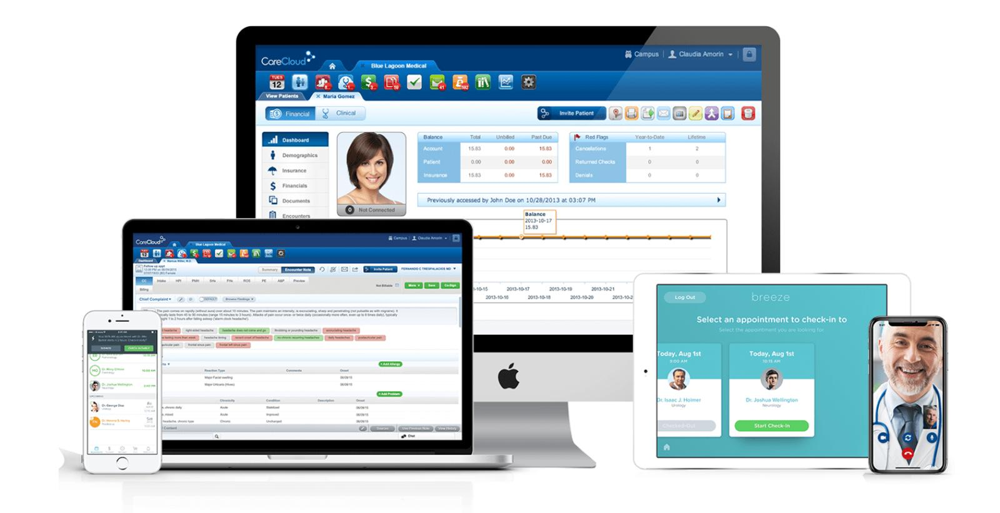
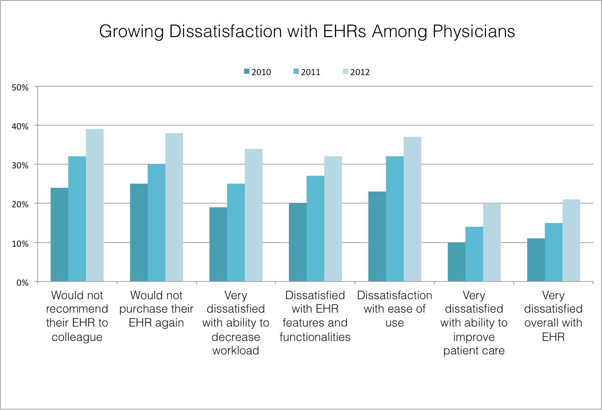

#  Electronic medical records and telemedicine

## Innovate developing country healthcare system

Gone are the days when the only option for the health care system data storing was writing patients’ medical information on paper and storing them alphabetically in a room full of shelves. Now with the help of technology medical records can be stored on a computer making it easy to access, few of errors and reducing tasks force. 

Electronic medical record (EMR) is a digital version of the paper charts in a medical facilities. It is used by healthcare providers to keep and maintain patient health information(medical history, medications, lab results, and treatment plan). EMRs can improve the efficiency and quality of care by making it easier to access and share patient information, as well as by providing alerts and reminders to help prevent errors. 

The use of technology, like, internet, video conferencing, electronic home monitor to provide remote medical services, such as diagnoses, consultation and treatment, to patients is called Telemedicine . It allows healthcare providers to remotely assess, diagnose, and treat patients, regardless of their physical location. This can include things like virtual consultations with a doctor, remote monitoring of vital signs, or sending electronic prescriptions. Telemedicine can also facilitate communication between healthcare providers and improve the coordination of care for patients. It has the potential to improve access to healthcare, particularly in remote or underserved areas, and it helps reduce the need for patients to travel to see a healthcare provider, giving the patients more resting time. 

### How reached is EMR and telemedicine globally. 
There are multiply factors that could effect the outreached of technology in the health care sector globally, such as the lack of infrastructure, low finance, lack of the know-how, etc. Therefore it is difficult to give an exact percentage to how reached EMR and telemedicine are globally. I would like to replace global with developed and underdeveloped countries. According to some studies, the percentage of developed countries that have adopted EMR systems ranges from 50-80%. However, the level of implementation and use can vary within these countries. In some countries, EMR systems are widely used and integrated into healthcare systems, while it is less common in under developed or third world countries, due to a variety of factors such as lack of infrastructure and funding. However, there are some efforts to implement EMR systems in these countries, often with the help of international organizations or developed countries. It's important to note that the adoption of EMRs in these countries requires a lot of resources and investments. 

### How Have telemedicine evolved
In past times, telemedicine focused on the basic interactions between healthcare providers and patients, which include, live video consultations. Nevertheless, with the invention new technologies, like smartphones, watches and wearable devices, telemedicine has largely evolved over the years, now we have option to serval others medical procedures remotely. Such as remote monitoring of vital signs and sending electronic prescriptions. 
Telemedicine has advance beyond just virtual consultations to include remote diagnostics, such as teleradiology, remote treatment, telerehabilitation, and the list goes on. 
Having had the experience to work in a local clinic as a registered,  one very important development of telemedicine is the integration of EMRs (Electronic Medical Records) a clinical information system that allows healthcare providers to have a more comprehensive view of the patient's health history and make the data easy to share and locate.  
The COVID 19 pandemic brought a lot of advancement in telemedicine, as thousand healthcare workers were at risk of contacting the virus, we saw healthcare providers giving consultations from homing, helping to reduce the virus tension and high transmission. 

### Invention/ services that telemedecine currently provide to health care.  

There are numerous devices and new developments that have been added to health systems globally over the past years due to the introduction of technology in the health care sector. Below are listed a few services that are presently available for healthcare providers and receiver use.  

Virtual consultations: now patients can have a live video consultation with a healthcare provider remotely using phone, internet, or video conferencing. 

Remote monitoring: A patients can wear a monitoring device so that his/her vital sign can be monitor be a healthcare provider remotely.  

### How can telemedicine improve the healthcare system in developing countries?  

  
Improved patient outcomes: Telemedicine and EMRs allow healthcare providers to monitor patients remotely and track their progress, which can lead to early identification of issues and prompt intervention. EMRs also enable healthcare providers to access patient information quickly and make more informed treatment decisions. 

Reduced costs: Telemedicine and EMRs can reduce the need for in-person visits, which can save patients and healthcare providers time and money. EMRs also enable healthcare providers to avoid duplicate tests and procedures, which can reduce costs for patients. 

Increased patient engagement: EMRs allow patients to access their health information and communicate with their healthcare providers more easily, which can increase their engagement in their own care. Telemedicine also allows patients to have virtual visits with their healthcare providers, which can increase their engagement in their own care. 

Improved data collection and analysis: EMRs allow healthcare providers to collect and analyze patient data more easily, which can help identify trends, patterns, and potential health issues. This information can be used to improve patient care, identify areas for improvement, and inform public health policies. 

 

Reduced costs: Telemedicine can help reduce costs for both patients and healthcare providers by eliminating the need for travel and in-person visits. 

Improved patient outcomes: Telemedicine allows for more frequent and consistent follow-up care, which can help improve patient outcomes and reduce the risk of complications. 

Increased efficiency: Telemedicine can help reduce wait times and improve the efficiency of healthcare delivery by allowing medical professionals to conduct virtual consultations and share patient information electronically. 

Better coordination of care: Telemedicine can help improve communication and coordination between healthcare providers, making it easier to share patient information and collaborate on treatment plans. 

More convenient for patients: Telemedicine allows patients to receive care from the comfort of their own homes, which can be more convenient and less stressful than in-person visits. 

More efficient use of resources: Telemedicine can help healthcare providers more efficiently use resources, such as expensive medical equipment, by allowing them to remotely monitor patients and share data. 

Improved patient satisfaction: Telemedicine can improve patient satisfaction by providing more convenient and accessible healthcare options and reducing the need for in-person visits. 

Increased access to care: Telemedicine allows patients in remote or underserved areas to receive medical consultations and treatment without having to travel long distances. EMRs also allow healthcare providers to share patient information with other providers, regardless of location. 
this is how to put a image 

this is how to put links [title of link](link)
